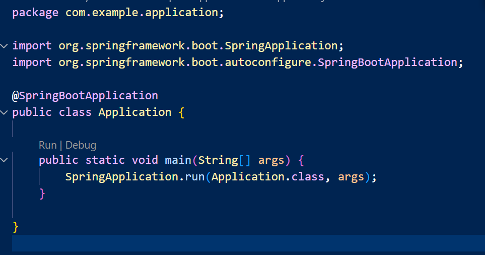

#   情報実験II_B班

## それぞれのアドレス
クライアント:http://自分のIPアドレス:8081

クライアント管理サーバ
WebSocket:ws://IPアドレス:8080
REST API:http://IPアドレス:8082

アプリケーションサーバ
WebSocket:ws://IPアドレス:8081
REST API:http://IPアドレス:8081

## IPアドレスの調べ方
コマンドプロンプトでipconfigと入力
Wireless LAN adapter Wi-Fiの欄のIPv4アドレスが自分のIDになる

## 実行方法:
__1:__ClientManagementServerのManagementServerLauncherを実行する

**2:**画像の真ん中にある薄い｢run｣をクリックする

各メンバーのブランチで編集する

javaファイルはそれぞれの[src/main/java/com/example/application]に入れる

HTMLファイルは[src/main/resources/templates]に入れる

CSSファイルは[src/main/resources/static/css]に入れる

JSファイルは[src/main/resources/static/js]に入れる

画像ファイルは[src/main/resources/static/images]に入れる

